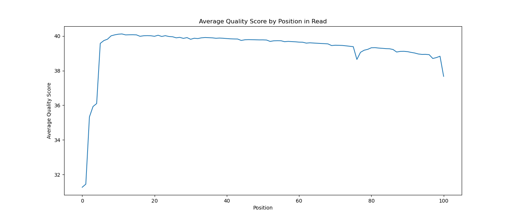
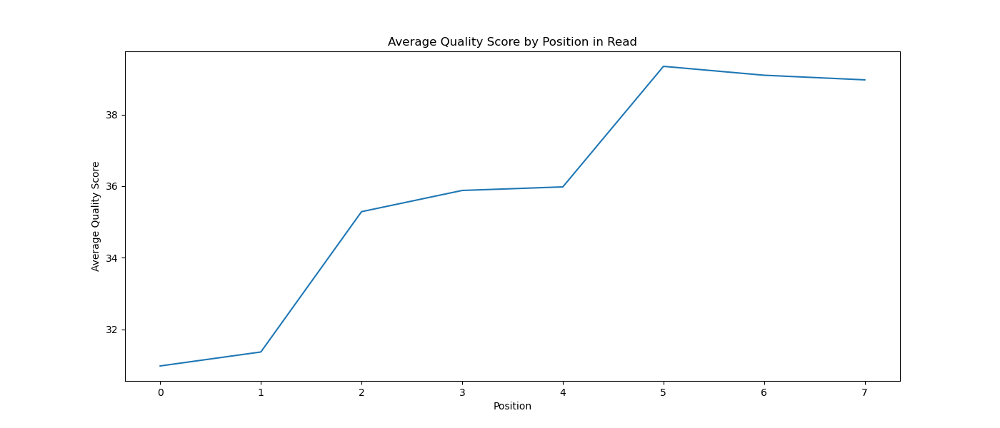
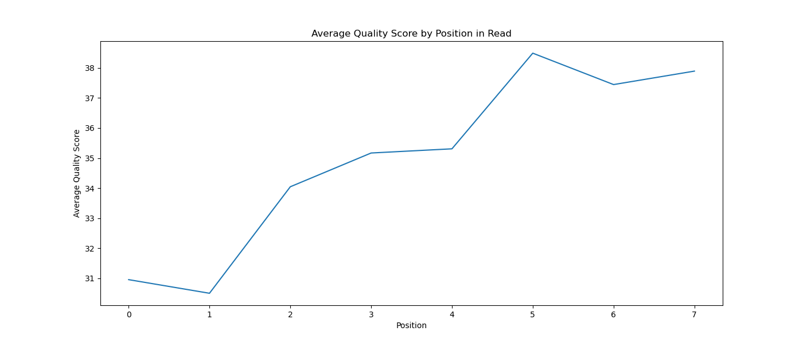
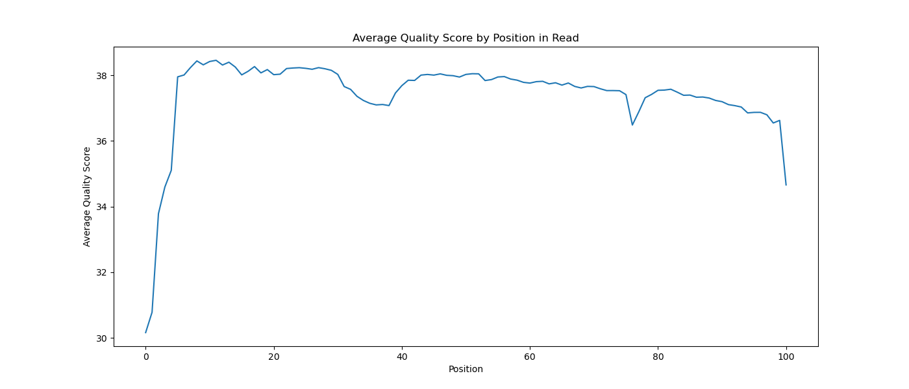

# Assignment the First

## Part 1
1. Link to Python script: [Part 1 script](./plot_quality_distribution.py)

	| File name | label | Read length | Phred encoding |
	|---|---|---|---|
	| 1294_S1_L008_R1_001.fastq.gz | read1 | 101 | phred-33 |
	| 1294_S1_L008_R2_001.fastq.gz | index1 | 8 | phred-33 |
	| 1294_S1_L008_R3_001.fastq.gz | index2 | 8 | phred-33 |
	| 1294_S1_L008_R4_001.fastq.gz | read2 | 101 | phred-33 |

2. Per-base NT distribution
    1. Distribution plots: <br>
	**R1**
   	
	**R2**
	
	**R3**
	
	**R4**
	

    3. **There is no need for a quality score cutoff for index reads.** <br>
	I calculated the Hamming distance (number of base differences between 2 sequences) between each pair of indexes (see `calculate_hamming.py`) and these are summary statistics that the script printed out:
		```
		The lowest Hamming distance is 3
		The median Hamming distance is 6.0
		The highest Hamming distance is 8
		```
		Even just looking at the lowest Hamming distance of 3, the chances that 3 bases will change to exactly match the bases of another index are very low. And during demultiplexing, in order for a pair of reads to be sorted into the incorrect sample, both of their indexes must have been sequenced incorrectly in exactly the same way (have the same exact sequencing errors when the reverse complement of R3 is taken). The chances of this happening are even lower. <br>
		**There is no need for a quality score cutoff for biological reads.** <br>
		Any reads that had many sequencing errors will likely not map well to the genome when we are aligning reads to the reference genome. Such reads will be naturally filtered out during that mapping step, so it is unnecessary to filter them out beforehand.
    4. **7304664 indexes have Ns**
       ```
       zcat 1294_S1_L008_R2_001.fastq.gz 1294_S1_L008_R3_001.fastq.gz | sed -n '2~4p' | grep 'N' | wc -l
       ```
    
## Part 2
### 1. Define the problem
We have received paired end sequencing data straight from the sequencer and these files have not been processed yet. The files are 4 zipped FASTQ files, each corresponding to R1 through R4, as read by the Illumina sequencer. The biological reads (R1 and R4) come from 24 different samples, which are identifiable by barcodes (R2 is barcode for R1 and R3 is barcode for R4), and we need to sort the reads by sample such that each sample gets its own set of 2 FASTQ files: one corresponding to the first/forward reads (R1) and the other corresponding to the second/reverse reads (R2) from the paired reads (i.e. barcodeA_R1.fq and barcodeA_R2.fq). During library prep, the barcodes attached to both biological reads are identical, so theoretically, the barcode for both biological reads should be identical. However, some barcodes may have been sequenced incorrectly (contain Ns or have low quality scores) and barcodes may have hopped between reads. Our goal is to sort the reads by sample while filtering out any reads that demonstrate index hopping, contain an invalid/unknown index, or have a low quality index. We will need to output two files (R1 and R2) per sample/index(total 48 files), two files (R1 and R2) for reads that have undergone index-hopping, and two files (R1 and R2) for unknown indexes or low-quality indexes, for a grand total of 52 files.
### 2. Describe output
- Files (total 52):
    - For each sample/index/barcode:
        - `<index>_R1.fq`
        - `<index>_R2.fq`
    - `index_hopped_R1.fq`
    - `index_hopped_R2.fq`
    - `undetermined_R1.fq`
    - `undetermined_R2.fq`
- Summary counts (printed to terminal):
    
    ```bash
    Number of read-pairs with properly matched indexes: 2004123
    Number of read-pairs with index-hopping observed: 30310
    Number of read-pairs with unknown index(es): 87312
    ```
    
- Table containing counts of with each barcode combination (saved in markdown file):
    
    
    | Barcode | AAA | BBB |
    | --- | --- | --- |
    | AAA | 20033 | 12 |
    | BBB | 5 | 432123 |
    - Diagonal will be correct dual index combinations
    - Could potentially turn this into a heatmap, where darker colors could mean higher counts
### 3. Unit Test Files
Upload your [4 input FASTQ files](../TEST-input_FASTQ) and your [>=6 expected output FASTQ files](../TEST-output_FASTQ).
### 4. Pseudocode
- Use `argparse` for input variables:
    - `-r1`: R1 input filename (string)
    - `-r2`: R2 input filename (string)
    - `-r3`: R3 input filename (string)
    - `-r4`: R4 input filename (string)
    - `-q`: quality threshold (float)
    - `-b`: file with barcodes
- Parse through barcode file (open it for reading) + make a list of barcodes
- Create a dictionary (`barcode_combos`) with keys as all possible pairs of barcodes separated by a dash and values as count of that barcode pair, initializing each counter to 0
    - Example: `{AAA-AAA: 0, BBB-BBB: 0, AAA-BBB: 0, BBB-AAA: 0}`
    - To determine all possible pairs and initialize the keys, use a nested for loop to loop through list of barcodes each time
- Initialize 3 counters to 0:
    - `correct_dual`
    - `index_hopped`
    - `unknown_indexes`
- Open all 4 FASTQ files for unzipping and reading using a while True loop
    - Strip lines + store record (4 lines at a time) of each file as a list of length 4:
        - `R1 = [ <header>,  <sequence>, <+>,  <quality_scores> ]`
        - `R2 = [ <header>,  <sequence>, <+>,  <quality_scores> ]`
        - `R3 = [ <header>,  <sequence>, <+>,  <quality_scores> ]`
        - `R4 = [ <header>,  <sequence>, <+>,  <quality_scores> ]`
    - Replace the sequence (second item) in `R3` with its reverse complement
        - Use `reverse_complement()` function to do this
    - Append a space followed by the sequence/barcode from `R2` and `R3` (second item in list) separated by “-” to the header line (first item in list) of `R1` and `R4`
    - If there are any Ns in index:
        - Use `append_record()` function to write `R1` and `R4` entries to `undetermined_R1.fq` and `undetermined_R2.fq`
        - Increment `unknown_indexes` counter by 1
        - Continue in while loop so that remaining statements within while loop are not executed for this entry
    - If either (or both) indexes do not match any of the indexes in list of barcodes:
        - Use `append_record()` function to write `R1` and `R4` entries to `undetermined_R1.fq` and `undetermined_R2.fq`
        - Increment `unknown_indexes` counter by 1
        - Continue in while loop so that remaining statements within while loop are not executed for this entry
    - Compute average quality score of indexes (from 4th item from `R2` and `R3`) using `avg_phred()` function
    - If quality score of either or both indexes is lower than quality threshold:
        - Use `append_record()` function to write `R1` and `R4` entries to `undetermined_R1.fq` and `undetermined_R2.fq`
        - Increment `unknown_indexes` counter by 1
    - If quality score of both indexes is equal to or greater than quality threshold:
        - Increment dictionary (`barcode_combos`) value for barcode combination by 1
        - If indexes are identical (second item of `R2` and second item of `R3`):
            - Use `append_record()` function to write `R1` and `R4` entries to `<index_sequence>_R1.fq` and `<index_sequence>_R2.fq`
            - Increment `correct_dual` counter by 1
        - If indexes not identical:
            - Use `append_record()` function to write `R1` and `R4` entries to `index_hopped_R1.fq` and `index_hopped_R2.fq`
            - Increment `index_hopped` counter by 1
- Break out of while True loop
- Print out `correct_dual`, `index_hopped`, `unknown_indexes` counts
- Using a nested for loop, loop through the barcodes and construct a 24 by 24 table (indexes as column/row headers) and fill in counts from dictionary (`barcode_combos`) for each index combination
    - See *Desired Output* section for example of table
    - As contents of table are being generated, write them to a markdown file
### 5. High level functions

```python
def reverse_complement(sequence: str) -> str: 
	```
	Takes in a string of nucleotides and outputs the reverse complement of that sequence. The order of nucleotides is reversed and the complementary nucleotide at each position is determined. The resulting sequence is returned as a string.
	
	```
	return rc

Example input: 'ATCG'
Expected output: 'CGAT'
```

```python
def avg_phred(sequence: str) -> float:
	```
	Takes in a string of ASCII characters encoded in Phred+33 and returns the average quality score (as a float) across all characters in input string.
	
	```
	return avg

Example input: 'BC'
Expected output: 33.5
```

```python
def append_record(r1_entry: list, r4_entry: list, output_file_prefix: str):
	```
	Inputs:
	- r1_entry: list of length 4, containing each line (in order) as a string of the first/forward read's FASTQ entry. There should be no new line characters.
	- r4_entry: list of length 4, containing each line (in order) as a string of the second/reverse read's FASTQ entry. There should be no new line characters.
	- output_file_prefix: string containing sample name or barcode. Entry will be written to <output_file_prefix>_R1.fq and <output_file_prefix>_R2.fq.
	
	Writes paired end reads to 2 output files: one corresponding to first/forward reads (Illumina Read 1), the other correponding to second/reverse reads (Illumina Read 4).
        If the files (<output_file_prefix>_R1.fq and <output_file_prefix>_R2.fq) do not exist in the current working directory, they will be created. If they already exist, the entry will be appended to the existing files. 
	
	```
        ## returns nothing

Example input: append_record(R1, R4, 'AAAAA')
Expected output: No explicit output, but R1 and R4 records written to AAAAA_R1.fq and AAAAA_R2.fq
```
